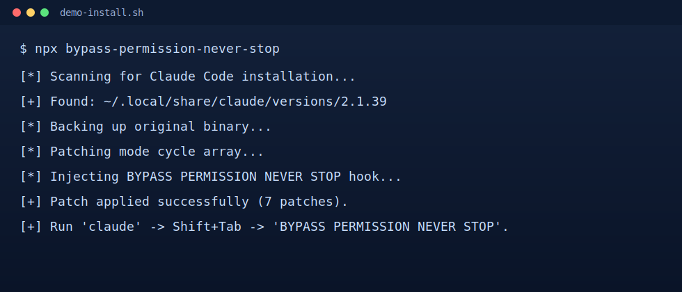
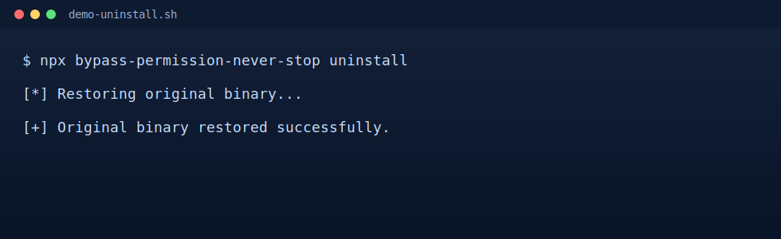

# bypass-permission-never-stop

[](https://www.npmjs.com/package/bypass-permission-never-stop)
[](https://www.npmjs.com/package/bypass-permission-never-stop)
[](https://github.com/KoreanThinker/bypass-permission-never-stop/stargazers)
[](https://github.com/KoreanThinker/bypass-permission-never-stop/actions/workflows/ci.yml)
[](https://github.com/KoreanThinker/bypass-permission-never-stop/actions/workflows/security.yml)

Unofficial Claude Code runtime patcher that injects a `neverStop` mode into the Shift+Tab mode cycle.

## Disclaimer

This project is **not** affiliated with Anthropic.
It patches Claude Code JavaScript runtime files and may violate product terms.
Use at your own risk.

## Quick Start

```bash
npx bypass-permission-never-stop
```

Restore original binary:

```bash
npx bypass-permission-never-stop uninstall
```

If your Claude installation is a native executable (`~/.local/share/claude/versions/*` Mach-O/ELF/PE),
the tool now blocks patching for safety.

## Command Examples

Patch installed Claude Code:

```bash
npx bypass-permission-never-stop
```

Note: native executable targets are blocked for safety.

Rollback to original binary:

```bash
npx bypass-permission-never-stop uninstall
```

Run local build directly:

```bash
npm run build
node dist/cli.js
node dist/cli.js uninstall
```

## Features

- One-command install patch flow
- Mixed install safety: prefers JavaScript target when local native + pnpm JS installs coexist
- Native executable safety guard (prevents corrupting Claude binary)
- `neverStop` mode added to mode cycle / mode label paths
- Hook injection for real interactive `chat:submit` loop in `2.1.49` (never-stop re-submit path)
- Circuit-breaker guard for repeated error loops
- Backup + restore (`uninstall`) with SHA-256 manifest
- Session log files in plain text

## Example Output

```text
[*] Scanning for Claude Code installation...
[+] Found: ~/.local/share/claude/versions/2.1.39
[*] Backing up original binary...
[*] Patching mode cycle array...
[*] Injecting never-stop hook...
[+] Patch applied successfully.
```

## Demo Assets

Install flow:



Uninstall flow:



## Development

```bash
npm install
npm run build
npm test -- --coverage
npm pack --dry-run
scripts/smoke-published.sh
npm run qa:mixed
npm run qa:pnpm2149
```

## CI / CD

- `CI`: runs build + coverage checks on push/PR
- `Release`: runs build/test and publishes to npm when a GitHub Release is published
- `Security Scan`: runs secret scanning on push/PR
- `Dependabot`: monthly npm dependency update PRs (non-major only)
- `Smoke Published Package`: weekly + manual smoke test against npm package
- `Growth Metrics`: weekly star/fork/watcher snapshot in workflow summary
- `Pages`: deploys `docs/` to GitHub Pages on `main`

### Required GitHub Secret

- `NPM_TOKEN`: npm token with publish permission and 2FA bypass enabled

### Recommended: npm Trusted Publishing

If you configure npm Trusted Publishing for this repository, you can remove long-lived publish tokens and rely on GitHub OIDC.
The `Release` workflow supports both modes automatically:

- If `NPM_TOKEN` exists, it uses token publish mode.
- If `NPM_TOKEN` is empty, it uses trusted publishing mode.

### Release Flow

1. Push changes to `main`
2. Create/publish a GitHub Release (for example `v0.1.1`)
3. `Release` workflow publishes package to npm automatically

## QA Baseline

- Test framework: Vitest
- Coverage target: 90%+
- Current baseline: `91%+` statement coverage

## Project Layout

```text
docs/PRD.md
signatures/
src/
tests/
```

## License

MIT

## Contributing

See `CONTRIBUTING.md`.

## Security

See `SECURITY.md`.

## Growth Plan

See `docs/GROWTH_PLAYBOOK.md`.

## Landing Page

See `docs/index.html` (GitHub Pages-ready static entry).
Published URL: `https://koreanthinker.github.io/bypass-permission-never-stop/`

## Troubleshooting

See `docs/TROUBLESHOOTING.md`.

## QA Report

See `docs/QA_REPORT.md`.

## Trusted Publishing

See `docs/TRUSTED_PUBLISHING.md`.

## Release Notes Template

See `.github/RELEASE_TEMPLATE.md`.

## Changelog

See `CHANGELOG.md`.

## Architecture

See `docs/ARCHITECTURE.md`.

## Social Templates

See `docs/SOCIAL_POST_TEMPLATES.md`.

## Community Posting Checklist

See `docs/COMMUNITY_POSTING_CHECKLIST.md`.

## FAQ

### Is this an official Anthropic tool?

No. This is an unofficial runtime patcher.

### Why does publish fail with npm E403 + 2FA message?

Your publish token likely does not have 2FA bypass permission.
See `docs/TROUBLESHOOTING.md`.

### How do I safely rollback?

Run:

```bash
npx bypass-permission-never-stop uninstall
```

### `claude` was getting killed immediately after patching. What should I do?

Run rollback first, then verify:

```bash
npx bypass-permission-never-stop uninstall
claude --version
```
